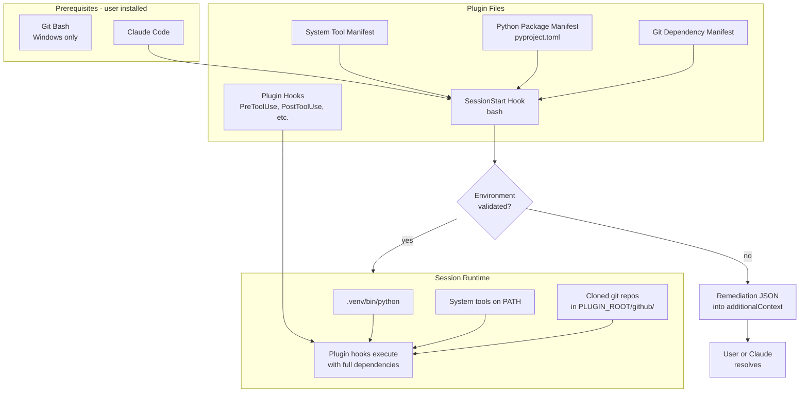
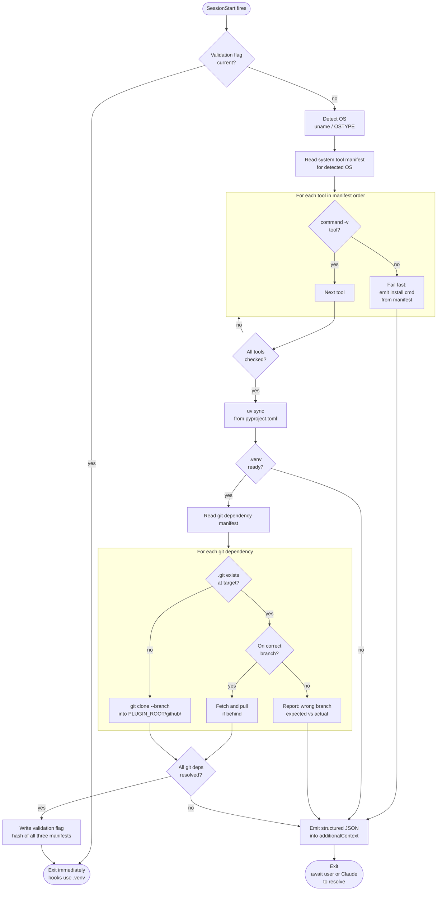

# Plugin Dependency Management: SessionStart Bootstrap Architecture

## Problem

Claude Code plugins can't depend on external software. The plugin cache contains only committed files — no dependency resolution, no virtual environments, no post-install hooks. Plugins that need PyPI packages, system CLI tools (jq, ruff, ffmpeg, etc.), or data from external sources (GitHub repositories, stub files, reference data) silently fail on machines where those things aren't installed or fetched. Every plugin author either punts to the user via README documentation, assumes tools exist and lets hooks fail at runtime, or avoids the problem entirely by writing markdown-only plugins.

## Proposed Architecture

A bash SessionStart hook that validates the entire plugin environment and either confirms everything is ready or injects precise, platform-specific remediation into Claude's context.

Bash is available on every platform Claude Code supports: native on macOS/Linux, required via Git Bash on Windows.

The plugin commits three manifests in its repository: a **system tool manifest** declaring required CLI tools per operating system, a **Python package manifest** (pyproject.toml) declaring PyPI dependencies, and a **git dependency manifest** declaring external git repositories to clone. All three ship with the plugin in the cache.

The environment is modeled as three explicit layers:

1. **Operating system** — macOS, Windows, Ubuntu. Detected first; determines everything downstream.
2. **System tools** — Per-OS entries declaring what to check and how to install. No defaults, no fallbacks — every dependency explicitly declares its install method for each platform it supports.
3. **.venv** — Cross-platform Python environment built from pyproject.toml via uv.

This layered model is **configuration-driven, not logic-driven**. The bash hook doesn't contain platform-specific conditional branches — it reads the manifest entry for the detected OS and executes exactly what's declared. If a tool needs `brew` on macOS and `apt` on Ubuntu, those are two explicit entries in the manifest. If `curl` is needed on all three platforms, it's declared three times.

### Step 1: Check for system packages

The hook detects the operating system, then reads the system tool manifest entries for that OS. Each entry declares a tool name, a check method (`command -v`), and an install method with the exact command to run.

The hook walks the manifest entries **in declared order**. For each tool:

1. **Check** via `command -v`. If found, the tool is available. Done.
2. **Fail fast if missing.** Emit the install command from the manifest entry into remediation output. Stop processing — do not continue to subsequent tools.

**Fail-fast philosophy**: The manifest author is responsible for declaring the full dependency chain. If a tool installs via `brew`, then `brew` itself must appear earlier in the manifest as its own entry. The hook does not infer or resolve transitive dependencies — it checks tools in order and fails on the first missing one. The author discovers missing chain links by running the hook and hitting errors, then fixes the manifest. This is iterative, ad-hoc analysis — no static dependency resolution needed.

**uv** is typically the first entry since it's the foundation for Step 2. Its install method is declared per-OS in the manifest like any other tool (e.g. `curl -LsSf https://astral.sh/uv/install.sh | sh` on macOS/Linux, `powershell.exe -ExecutionPolicy ByPass -c "irm https://astral.sh/uv/install.ps1 | iex"` on Windows).

If anything is unresolved, the hook emits structured JSON via stdout into Claude's `additionalContext` with the specific failure and the exact install command from the manifest. The user can fix it themselves or tell Claude "install it" — Claude already has the exact command.

The hook stops here if anything is unresolved. Steps 2, 3, and 4 only run when all system packages are available.

### Step 2: Create or update .venv

With uv available, the hook creates or updates the plugin's virtual environment from the Python package manifest (pyproject.toml) committed in the plugin repository. This is a `uv sync` call from bash — the hook itself doesn't need to be a Python script.

After this step, the plugin's hooks can invoke scripts using the .venv's Python interpreter with all declared PyPI dependencies available. All hooks share one environment. One install, one place to manage.

### Step 3: Fetch git dependencies

With system tools verified and the .venv ready, the hook processes the git dependency manifest. This manifest declares external git repositories to clone.

Each repository is declared with a URL and branch:

```yaml
git_dependencies:
  - url: https://github.com/user/ue-python-stubs.git
    branch: main
```

The target directory is derived from the URL: `${PLUGIN_ROOT}/github/<repository-name>/` (e.g., `github/ue-python-stubs/`). No custom paths — the `github/` directory is gitignored.

For each repository, the hook follows this logic:

1. **Check if already cloned.** If `target/.git` exists and the checkout is on the correct branch, the repository is present. Optionally fetch and check if behind upstream.
2. **Clone if missing.** `git clone --branch <branch> <url> <target>`. Parent directories are created automatically. The hook uses a 5-minute timeout for clone operations.
3. **Pull if stale.** If the repo exists but is behind upstream, pull. Never auto-switch branches — if the local checkout is on a different branch, that's an error reported in remediation.

If any repository fails to clone, the hook emits remediation into `additionalContext` with the specific failure (network error, auth failure, disk space, etc.) and suggested resolution. The hook does not proceed to step 4.

### Step 4: Disable hook for future sessions

Only if steps 1, 2, and 3 all pass with no issues does the hook write a validation flag (keyed to a hash of all three manifests). On subsequent SessionStart invocations, the hook checks this flag first and exits immediately if current.

If any manifest changes, the hash changes, the flag goes stale, and the full check re-runs. This means zero overhead on normal sessions, full validation only when something actually changes.

### Key Design Decisions

**The entire hook is bash.** System tool checks are `command -v`. Platform detection is `uname`. The .venv is built by calling out to `uv`, not by running a Python script.

**Configuration-driven, not logic-driven.** The hook contains no platform-specific conditional branches for individual tools. It detects the OS once, reads the manifest entries for that OS, and executes what's declared. All platform-specific knowledge lives in the manifest, not the hook code.

**Explicit per-OS entries, no defaults.** Every tool dependency declares its check and install method for each platform it supports. There are no implicit defaults or fallback chains. If `curl` is needed on all platforms, it appears three times. This makes the manifest the complete truth — you can read it and know exactly what happens on each OS.

**Fail-fast, not auto-resolve.** If a manifest entry says "install jq via brew" but brew isn't installed, that's a hard error. The fix is adding `brew` as an earlier entry in the manifest. The hook doesn't infer transitive dependencies — the manifest author discovers them iteratively by running the hook and fixing errors.

**Plugin dependencies are committed in the plugin repo.** Three manifests: a system tool manifest declaring per-OS CLI dependencies, a pyproject.toml declaring Python packages, and a git dependency manifest declaring external repositories to clone. The hook doesn't generate dependency specs — it reads the manifests and acts on them.

**uv is the only hard prerequisite.** Once uv exists, it can install Python versions, create virtual environments, and resolve packages. Everything else flows from uv being present.

**Git dependencies live inside the plugin directory.** Cloned repositories go into `${PLUGIN_ROOT}/github/<repository-name>/`, a gitignored subdirectory of the plugin. The target directory is derived from the clone URL — no custom paths. This keeps the manifest simple and the layout predictable.

**Git repositories track branches, not commits.** The hook clones at a declared branch and pulls to stay current. This matches how plugins typically consume reference data — they want the latest from a known branch, not a pinned snapshot. Pinning to a tag or commit is possible by setting branch to a tag name, but the common case is tracking a living branch.

**Claude gets actionable context, not just error messages.** Remediation instructions land in `additionalContext` where Claude can act on them. The user sees what's missing and can either fix it themselves or delegate to Claude, which already has the exact commands.

### What This Enables

After SessionStart completes, the plugin environment is fully resolved. Plugin hooks run against a real .venv with full access to their declared PyPI dependencies. System CLI tools are verified present. External git repositories are cloned and current. If anything was missing, Claude has a precise, platform-specific remediation plan in context.

The plugin author declares what they need in three manifests — a system tool manifest for CLI tools, a pyproject.toml for Python packages, and a git dependency manifest for repositories — commits them in the plugin repo, and the SessionStart hook ensures the runtime can provide it.

### Appendix A: Plugin Architecture Diagram



### Appendix B: SessionStart Hook Flow



### Appendix C: System Tool Manifest Schema

> **Full schema reference**: `plugins/unreal-kit/skills/session-bootstrap/references/manifest-schemas.md`

The system tool manifest declares per-OS entries. Each OS section lists tools in dependency order — the hook processes them sequentially and fails on the first missing tool.

```yaml
system_tools:
  macos:
    - name: brew
      check: "brew"
      install: 'bash -c "$(curl -fsSL https://raw.githubusercontent.com/Homebrew/install/HEAD/install.sh)"'
    - name: uv
      check: "uv"
      install: "curl -LsSf https://astral.sh/uv/install.sh | sh"
    - name: jq
      check: "jq"
      install: "brew install jq"       # brew appears before jq — author's responsibility

  windows:
    - name: uv
      check: "uv"
      install: 'powershell.exe -ExecutionPolicy ByPass -c "irm https://astral.sh/uv/install.ps1 | iex"'
    - name: jq
      check: "jq"
      install: "choco install jq"

  ubuntu:
    - name: curl
      check: "curl"
      install: "sudo apt install -y curl"
    - name: uv
      check: "uv"
      install: "curl -LsSf https://astral.sh/uv/install.sh | sh"
    - name: jq
      check: "jq"
      install: "sudo apt install -y jq"
```

**Key properties:**
- No defaults or inheritance — each OS section is self-contained
- Order matters — if `jq` installs via `brew`, `brew` must appear earlier
- The hook reads only the section for the detected OS
- `check` is always the argument to `command -v`
- `install` is the exact shell command to run — no templating or variable substitution

### Appendix D: System Tool Dependencies Found in the Wild (Audit)

An audit of Claude Code plugin hooks found 19 non-standard tool dependencies across the ecosystem:

| Tool | Usage Count | Category |
|------|-------------|----------|
| git | 25 | version control (ubiquitous) |
| claude | 6 | Claude Code CLI |
| jq | 4 | JSON processing |
| uv | 2 | Python package manager |
| yq | 2 | YAML processing |
| gh | 1 | GitHub CLI |
| rg | 1 | ripgrep |
| bat/batcat | 1 | file viewing |
| vale | 1 | prose linting |
| yamllint | 1 | YAML linting |
| kitten | 1 | Kitty terminal |
| code | 1 | VS Code |
| vi | 1 | text editor |
| node/npm | 1 | Node.js |
| brew | 1 | macOS packages |
| apt-get | 1 | Debian packages |
| wget | 1 | file download |

Some of these (git, claude, node) can be assumed present since Claude Code itself depends on them. Others (jq, yq, gh, rg, vale, yamllint) are real system tool dependencies that plugins need but have no way to declare or verify today.

### Appendix E: Git Dependency Manifest Examples

> **Full schema reference**: `plugins/unreal-kit/skills/session-bootstrap/references/manifest-schemas.md`

A plugin's git dependency manifest declares external repositories to clone. Target directories are derived from the URL — always `${PLUGIN_ROOT}/github/<repository-name>/`.

**Example: Unreal Engine plugin needing stubs and reference examples**

```yaml
git_dependencies:
  - url: https://github.com/user/ue-python-stubs.git
    branch: main
  - url: https://github.com/EpicGames/UnrealEngine-Python-Examples.git
    branch: main
```

Clones to:
- `${PLUGIN_ROOT}/github/ue-python-stubs/`
- `${PLUGIN_ROOT}/github/UnrealEngine-Python-Examples/`

**Example: Code quality plugin needing shared rulesets**

```yaml
git_dependencies:
  - url: https://github.com/org/lint-config.git
    branch: v2
```

Clones to:
- `${PLUGIN_ROOT}/github/lint-config/`

**Key design notes:**

- `url` uses HTTPS for public repos. SSH URLs (`git@github.com:...`) are supported but require the user to have SSH keys configured — if clone fails due to auth, the remediation reports this clearly.
- `branch` can be a branch name, tag, or commit hash. Branch names track latest; tags and commits pin to a specific version.
- The manifest intentionally does not support post-clone hooks or build steps. If cloned data needs transformation, the plugin's own scripts handle that separately. The bootstrap ensures the raw data is available — nothing more.

